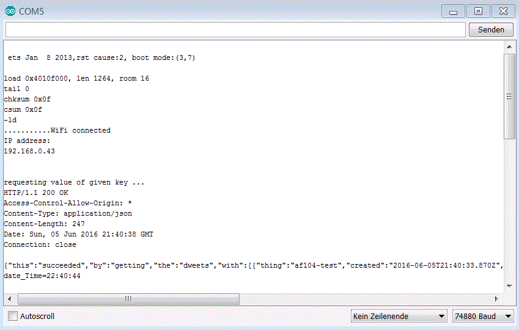

### Simple Dweet.IO Get Example

Preconditions: another IoT device is sending data to Dweet.IO server with rewuested key infomation
E.g. see NoceMCU Lua project 

```C++
#include "dweetESP8266.h"
#define THIG_NAME  "af104-test"  // Put here your thing name
#define key  "date_Time"  // Put here your requested key
}
```

```C++
void loop() {
    // specifies the args of type "String"
    String value = client.getDweet(THIG_NAME, key);
    Serial.print(key); Serial.print("=");
    Serial.println(value);
}
```

####Result


