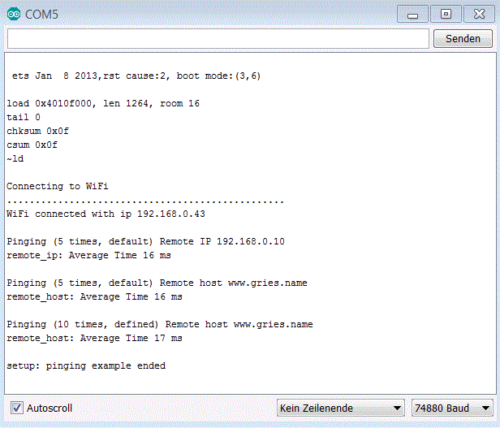

## Simple Ping sketch for ESP8266 

Library ESP8266Ping granted by dancol90 at [github](https://github.com/dancol90/ESP8266Ping)

### enhanced sketc and modified library

modified library and keywords.txt found here

```C++
    // bool ping(IPAddress dest,   byte count = 5);
    // bool ping(const char* host, byte count = 5);
    bool remoteIP(IPAddress dest,   byte count = 5);
    bool remoteHOST(const char* host, byte count = 5);
````

```C++
#######################################
# Methods and Functions (KEYWORD2)
#######################################

ping	KEYWORD2
remoteIP	KEYWORD2
remoteHOST	KEYWORD2
````


Serial: 

