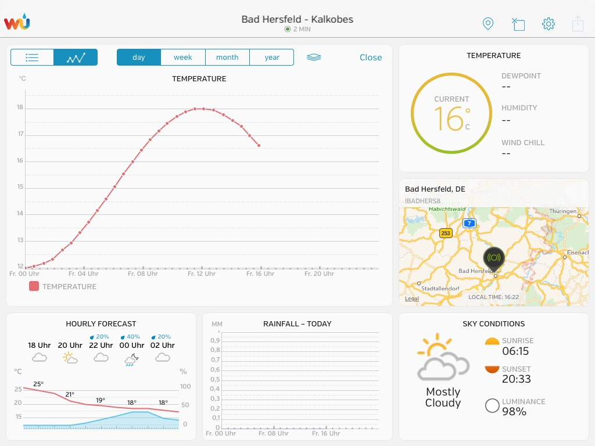
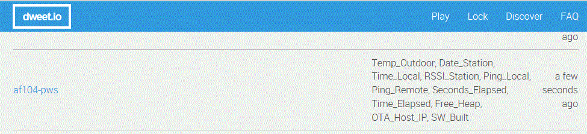
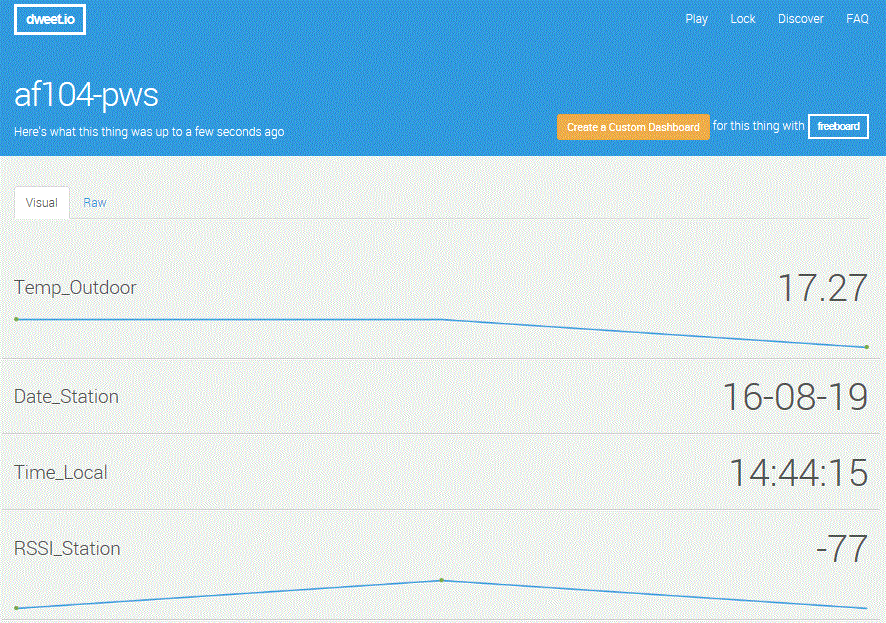
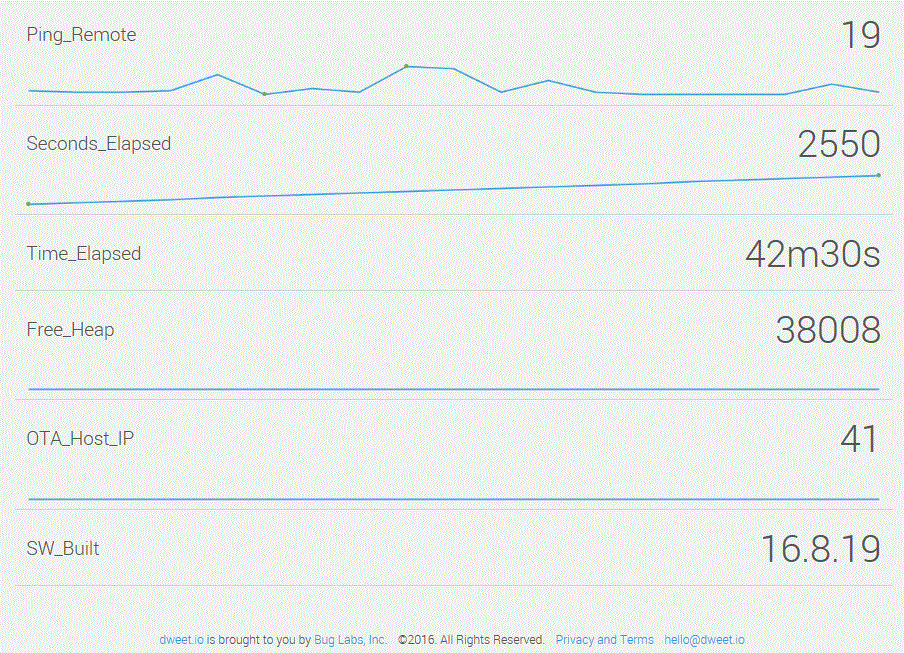
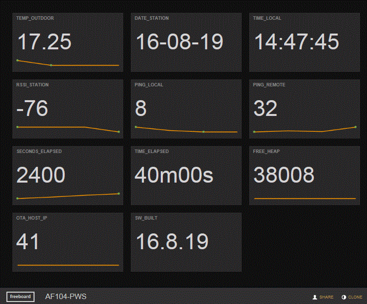

##Project af104-pws

Simulating temp_Outdoor value send to Personal Weather Station (PWS)
using ESP8266 Wifi chip

PWS used: IBADHERS8 [IBADHERS8](https://www.wunderground.com/personal-weather-station/dashboard?ID=IBADHERS8)

Monitoring via Dweet.IO:

Dweet.IO example (status 2016-08-19)

Data visualization using Freeboard 

